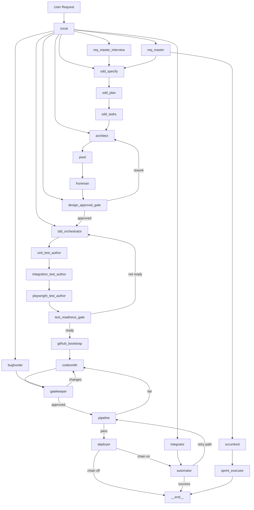

# SWEAT Architecture (As-Built)

_Last updated: 2026-02-25 UTC_
_Status: living document (update on every architecture change)_

## Architecture version
- **Version:** `v1.5.7-as-built`
- **Baseline date:** `2026-02-28`
- **Owner:** SWEAT architecture maintainers
- **Change policy:** every node/edge/gate/integration change must update this document + changelog entry.

## Architecture changelog

| Date (UTC) | Version | Changed by | Summary |
|---|---|---|---|
| 2026-02-24 | v1.0.0-as-built | Zocai | Established as-built architecture with full node taxonomy, complete system diagram, controls, integrations, and living-document protocol. |
| 2026-02-24 | v1.1.0-as-built | Zocai | Refreshed as-built docs to match latest implementation: sprint executor v2, security remediation loop, pipeline-to-Linear summary posting, and governance hardening. |
| 2026-02-25 | v1.2.0-as-built | Zocai | Added explicit documentation of current runtime state management and memory/communication tracking model (in-memory orchestration + persisted artifacts/integrations). |
| 2026-02-25 | v1.3.0-as-built | Zocai | Implemented phased state-hardening (Phase 1-3): append-only run event log, canonical inter-node event schema, project state snapshots, and idempotency/version-concurrency safeguards. |
| 2026-02-26 | v1.3.1-as-built | Zocai | Added Linear hard-fail configuration diagnostics (missing API key/team id) and per-run startup check artifact (`reports/runs/startup_check.json` + `projects/<slug>/state/startup_check.json`). |
| 2026-02-26 | v1.3.2-as-built | Zocai | Hardened req/spec handoff convergence: shared SDD requirements validator, interview revision gating, regenerate-only-on-human-input policy, parser JSON decode scan robustness, and snapshot merge precedence fix for persisted state. |
| 2026-02-26 | v1.3.3-as-built | Zocai | Added resumable runtime state artifact (`resume_state.json`), corrected revision counter semantics for AI-only loops, aligned req_master success route to SDD path, enriched route-decision observability payloads, and added stale-report validation utility. |
| 2026-02-27 | v1.3.4-as-built | Zocai | Applied P0 hardening: added explicit zocai `__end__` route, hardened workspace path guards with `commonpath`, fixed coder alias factory gaps, introduced pipeline/automator retry budgets, and began workspace-affinity execution (`specify` + pipeline subprocess cwd + key artifact writes). |
| 2026-02-27 | v1.3.5-as-built | Zocai | Added state-truth normalization and fail-safe behavior: CI status normalization (`PASSED` variants), deployment approval excludes placeholder values, and version-conflict now halts run with explicit failure event/message. |
| 2026-02-27 | v1.3.6-as-built | Zocai | Completed workspace-affinity hardening for worker artifact writes and tool execution paths: Pixel/Frontman/Design/TDD/BugHunter/deploy/integration writes now project-scoped; tool-call validation/execution enforces project workspace for file operations. |
| 2026-02-27 | v1.3.7-as-built | Zocai | Added lifecycle loop-proofing guards with explicit retry budgets and fail reasons across pipeline/automator/deployer transitions to prevent unbounded churn and force terminal outcomes on exhaustion. |
| 2026-02-27 | v1.3.8-as-built | Zocai | Hardened pipeline CI/deploy consistency by making Playwright execution requirement-aware (workspace auto-detect + override flag), reducing false strict-gate failures on non-Node projects while preserving enforceable E2E where applicable. |
| 2026-02-27 | v1.3.9-as-built | Zocai | Introduced P1 node-contract enforcement scaffolding: lightweight state-patch validators for high-risk handoffs (req/spec/gates/pipeline), validation events in telemetry, and strict-contract halt mode (`SWEAT_STRICT_CONTRACTS`). |
| 2026-02-27 | v1.4.0-as-built | Zocai | Expanded contract guards to lifecycle/coding gates (codesmith/gatekeeper/automator/deployer) and added strict E2E route-check validator script (`scripts/validate_strict_e2e.py`) for milestone acceptance evidence. |
| 2026-02-27 | v1.4.1-as-built | Zocai | Added one-command strict E2E validation runner (`scripts/run_strict_e2e_check.py`) that resolves latest run_id, executes route-check validator, and emits canonical artifact (`reports/runs/strict_e2e_validation.json`) for milestone signoff. |
| 2026-02-27 | v1.4.2-as-built | Zocai | Added milestone signoff wrapper (`scripts/milestone_signoff.py`) to run strict-E2E and freshness checks together and emit consolidated JSON/Markdown evidence artifacts for release/milestone closure. |
| 2026-02-27 | v1.4.3-as-built | Zocai | Added stale-report auto-refresh helper (`scripts/refresh_latest_run_report.py`) and wired milestone signoff pre-step to regenerate latest run artifact for target project before validation, eliminating false stale-project mismatches. |
| 2026-02-27 | v1.4.4-as-built | Zocai | Added strict E2E convergence debug harness (`scripts/run_strict_e2e_cycle.py`) and route-diff reporting utility (`scripts/route_diff_report.py`) to isolate progression stalls and compare route behavior between fix cycles. |
| 2026-02-27 | v1.4.5-as-built | Zocai | Extended milestone signoff with optional `--rerun` mode to execute a fresh strict E2E cycle before validation, improving signoff evidence freshness and reducing stale-run acceptance risk. |
| 2026-02-27 | v1.4.6-as-built | Zocai | Added `--max-steps` passthrough to milestone signoff rerun mode for fast/debug E2E cycles, enabling shorter validation loops while preserving consolidated signoff artifacts. |
| 2026-02-27 | v1.4.7-as-built | Zocai | Added `--run-id` override to milestone signoff flow so refresh/strict-validation can target an explicit historical run deterministically, improving reproducible debugging and signoff traceability. |
| 2026-02-27 | v1.4.8-as-built | Zocai | Improved strict-run progression reliability by forwarding gatekeeper on codesmith halt policy and validated an end-to-end signoff PASS on explicit run id (`run_2026-02-27T15-56-30Z_66bd36`) via consolidated milestone signoff artifacts. |
| 2026-02-28 | v1.4.9-as-built | Zocai | Implemented JSON-schema enforcement for state artifacts: added state schemas, validator script, dependency support, and CI workflow gate for canonical project state validation. |
| 2026-02-28 | v1.5.0-as-built | Zocai | Added legacy state-artifact backfill utility and project-level concurrency lock enforcement in state store (non-blocking lock with explicit contention error), with tests and reporting artifacts for migration/lock safety. |
| 2026-02-28 | v1.5.1-as-built | Zocai | Addressed critical red flags: prevented terminal run-status downgrades (failed/blocked cannot be overwritten by completed) and wired resume-state load path at run bootstrap (`SWEAT_AUTO_RESUME`) with explicit merge precedence for incoming state. |
| 2026-02-28 | v1.5.2-as-built | Zocai | Closed high-priority red flags by expanding state-schema CI to all discovered projects (`validate_all_states.py`), tightening structured tool-call behavior default (`SWEAT_CODEX_STRICT_TOOLS=true`), and adding lifecycle policy matrix tests for gate behavior invariants. |
| 2026-02-28 | v1.5.3-as-built | Zocai | Completed medium/low remediation pass: added normalized decision reason codes across lifecycle gates/transitions, standardized CI/runtime bootstrap usage in workflows, and documented canonical report freshness policy to reduce stale-evidence acceptance risk. |
| 2026-02-28 | v1.5.4-as-built | Zocai | Closed recheck high-risk trio: fixed CI workflow parity (Playwright conditional + security report block correction), and enforced terminal event/status invariant so `run_end` payload matches persisted final status under precedence rules. |
| 2026-02-28 | v1.5.5-as-built | Zocai | Completed final production-readiness verification bundle: all-project state schema validation PASS, strict signoff rerun PASS, 5/5 North-Star stability runset PASS (100%), scorecard GREEN, and published production readiness GO report. |
| 2026-02-28 | v1.5.6-as-built | Zocai | Unified model policy across agents: main LLM now follows explicit primary->secondary->tertiary alias order (defaults to coder policy) with shared fallback chain; prevents unexpected ReqMaster Gemini-only routing unless configured. |
| 2026-02-28 | v1.5.7-as-built | Zocai | Added project-specific signoff enforcement for command-center-dashboard: milestone signoff now includes requirement-aware artifact gate (`scripts/validate_project1_dashboard.py`) to prevent generic lifecycle PASS without dashboard baseline deliverables. |

## 1) Purpose
This is the **as-built** architecture for SWEAT as it exists now in code.

## 2) Node taxonomy (current)

### A) Core persona agents
1. `zocai`
2. `req_master`
3. `req_master_interview`
4. `architect`
5. `pixel`
6. `frontman`
7. `codesmith`
8. `bughunter`
9. `gatekeeper`
10. `integrator`
11. `automator`
12. `deployer`
13. `scrumlord`

### B) SDD stages
14. `sdd_specify`
15. `sdd_plan`
16. `sdd_tasks`

### C) Gates / quality controls
17. `design_approval_gate`
18. `tdd_orchestrator`
19. `unit_test_author`
20. `integration_test_author`
21. `playwright_test_author`
22. `test_readiness_gate`
23. `pipeline`

### D) PM/autonomy executors
24. `sprint_executor`

### E) Infra/bootstrap node
25. `github_bootstrap`

### F) Terminal
26. `__end__`

## 2.1) Node catalog (role + function)

| Node | Role type | Function |
| ----------------------- | -------------------- | ---------------------------------------------------------------------------- |
| zocai | Orchestrator | Chooses next node; enforces high-level routing/gates. |
| req_master | Persona agent | Requirement parsing/generation (legacy-compatible path). |
| req_master_interview | Persona+gate | Interview-first requirement collection; asks missing questions. |
| sdd_specify | SDD stage | Builds/validates spec artifact; runs specify integration. |
| sdd_plan | SDD stage | Produces technical plan from approved spec. |
| sdd_tasks | SDD stage | Produces executable task breakdown. |
| architect | Persona agent | Generates architecture/system design outputs. |
| pixel | Persona agent | Produces structured UX package (personas/journey/screens/tokens). |
| frontman | Persona agent | Produces UI/component contract/artifacts from UX package. |
| design_approval_gate | Gate | Blocks coding until design prerequisites are complete. |
| tdd_orchestrator | Stage coordinator | Starts test-first flow and coverage policy. |
| unit_test_author | Test stage | Creates unit-test plan/scaffold and coverage setup. |
| integration_test_author | Test stage | Creates integration-test plan/scaffold. |
| playwright_test_author | Test stage | Creates functional/e2e (Playwright) plan/scaffold. |
| test_readiness_gate | Gate | Ensures tests are ready before coding unlock. |
| github_bootstrap | Infra/bootstrap | Creates private repo, initializes/pushes git, applies repo policy bootstrap. |
| codesmith | Persona agent | Main coding agent; executes validated tool calls with retry safeguards. |
| bughunter | Persona agent | Testing/bug-hunt planning support node. |
| gatekeeper | Persona+quality gate | Code review gate before CI progression. |
| pipeline | CI gate | Runs CI/test/security checks; decides pass/fail progression. |
| integrator | Persona agent | Integration contract/workflow handling. |
| automator | Automation agent | Triggers n8n workflow(s), handles automation completion state. |
| deployer | Deployment agent | Writes CI/CD/deploy artifacts and deployment-stage outputs. |
| scrumlord | PM agent | Creates and manages Linear backlog/project issues. |
| sprint_executor | PM automation | Executes sprint loop policy (priority/WIP/multi-issue actions). |
| __end__ | Terminal state | Graph termination point. |

## 3) Complete system diagram (as-built)

## 4) Main lifecycle (golden path)
1. `req_master_interview`
2. `sdd_specify -> sdd_plan -> sdd_tasks`
3. `architect -> pixel -> frontman -> design_approval_gate`
4. `tdd_orchestrator -> unit_test_author -> integration_test_author -> playwright_test_author -> test_readiness_gate`
5. `github_bootstrap`
6. `codesmith -> gatekeeper -> pipeline`
7. `deployer -> automator -> __end__`

## 5) Critical controls
- interview-first SDD gate
- design approval gate
- TDD readiness gate
- CodeSmith validation/sandbox/circuit-breaker
- gatekeeper fallback controls
- strict CI + security remediation loop
- private-repo bootstrap and branch policy enforcement
- pipeline auto-documentation to Linear
- run telemetry and report artifacting

## 6) State management model (current as-built)
SWEAT currently uses a **hybrid state model**:

### 6.1 Runtime orchestration state (in-memory)
- A graph run starts with shared `ProjectState` (e.g., project context, routing intent, gate flags, messages).
- Each node reads from this run state and emits partial updates.
- LangGraph merges updates and advances by `next_agent`/graph edges.
- Gates (`design_approval_gate`, `test_readiness_gate`, `pipeline`) evaluate run state to permit/block transitions.
- This layer is optimized for orchestration correctness and low-latency routing during a single run.

### 6.2 Persisted project/integration state (durable)
- Durable outputs are written as project artifacts (`docs/spec/*`, `docs/tests/*`, reports, deployment artifacts).
- Git history provides versioned provenance of state transitions over time.
- External systems (e.g., Linear, CI, automation workflows) hold additional operational state.
- This layer is the continuity mechanism across runs/restarts and for audit/review.

### 6.3 Practical implications
- **Strength:** clear separation of execution-time control vs long-term project truth.
- **Constraint:** in-memory run state is ephemeral; continuity depends on reliable artifact/integration writes.

## 7) Memory and inter-node communication tracking (current)
Memory/communication is currently tracked through these channels:

1. **In-run shared state**
   - Node-to-node coordination happens through shared `ProjectState` updates.
   - This is the primary machine-readable handoff surface during execution.

2. **Artifacts as durable memory**
   - Outputs from requirement/spec/design/test/deploy stages are persisted to repo files.
   - These files serve as working memory across future runs.

3. **System/integration memory**
   - CI logs/results, Linear issue history, and automation execution status capture additional run context.

4. **Git as longitudinal memory**
   - Commits/PRs act as time-ordered record of architecture and implementation changes.

> As-built note: communication tracking is distributed across state + artifacts + integrations; there is no single canonical append-only event bus documented as mandatory at this time.

## 8) Enforced state/memory hardening rollout (Phase 1-3)

### Phase 1 (implemented)
- Introduced per-project append-only event stream: `projects/<slug>/state/run_events.jsonl`.
- Standardized event envelope fields (`event_id`, `run_id`, `node`, `event_type`, `seq`, `payload`, `ts_utc`).
- Added `run_index.json` for fast run status + last sequence tracking.

### Phase 2 (implemented)
- Added canonical inter-node communication logging via runtime events:
  - `run_start`, `node_enter`, `route_decision`, `node_exit`, `state_patch_applied`, `run_end`, `validation_error`.
- Added durable snapshot artifact: `project_state.json` with lifecycle/gates/artifacts/integrations summary.

### Phase 3 (implemented)
- Added idempotency keys for event emission to prevent duplicate event entries on retries.
- Added optimistic version checks on snapshot writes (`project_state_version` expectation).
- Added version conflict handling with explicit `validation_error` events.
- Enforced atomic snapshot/index writes (temp file + rename) to avoid partial state corruption.
- Added startup diagnostics artifact per run (env/config presence checks for Linear + model providers).
- Added Linear hard-fail precondition checks for missing `LINEAR_API_KEY` / `LINEAR_TEAM_ID` in team-scoped operations.

## 9) Change management
When architecture changes:
1. update this file in same change set,
2. update node taxonomy **and Node catalog table (2.1)**,
3. update Mermaid diagram,
4. update controls/integration/state/memory sections,
5. append changelog entry.

<!-- DOC_SYNC: 2026-02-25 -->
