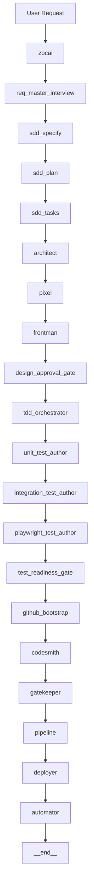

# SWEAT Production Operator Runbook

_Last updated: 2026-03-03 UTC_

## 1) Operating mode
Run SWEAT in controlled autonomous mode with strict gates enabled for production repositories.

## 2) Required guardrails
- repos private-only
- `.env` and secrets never tracked in git
- strict CI/security pipeline enabled
- branch protection enforced
- Linear documentation and telemetry enabled

## 3) Recommended env flags
- `SWEAT_STRICT_TEST_GATE=true`
- `SWEAT_DEPLOY_STRICT_CI=true`
- `SWEAT_CHAIN_AUTOMATOR_AFTER_DEPLOY=true`
- `SWEAT_LINEAR_PIPELINE_COMMENT=true`
- `SWEAT_ALLOW_BRANCH_PROTECTION_BYPASS=false` (default secure stance)

## 4) End-to-end flow



## 5) Security operational loop
Strict CI security stage performs:
1. initial scan
2. remediation plan generation
3. safe remediation attempt
4. rescan
5. before/after report generation
6. policy enforcement and summary publication
7. artifact upload
8. pipeline summary auto-comment to Linear

## 6) Incident response
- If pipeline fails: inspect diagnostics in pipeline message and `reports/security/security_remediation_report.md`
- If model instability appears: review CodeSmith fallback chain and telemetry
- If automation loops: verify `automation_completed` state and chain flags

## 7) Routine checks
- review `reports/runs/latest_run_report.json`
- review latest security remediation report
- verify Linear issue state transitions and comments

## 8) Monitoring command center (Project 1)
Run the monitoring API service:

```bash
source .venv/bin/activate
uvicorn src.app:app --host 0.0.0.0 --port 8000
```

Core endpoints:
- `GET /api/monitoring/projects`
- `GET /api/monitoring/projects/{project_id}`
- `GET /api/monitoring/stream?project_id=...`
- `POST /api/monitoring/projects/{project_id}/interview/answer`

Operator expectations:
- watch blocker panel (`validation_error`, failed/blocked run states)
- monitor live stream status (`connected`, `error`, `disconnected`)
- answer req_master interview questions directly from UI
- inspect artifacts from the details page registry before approving progression

<!-- DOC_SYNC: 2026-03-03 -->
