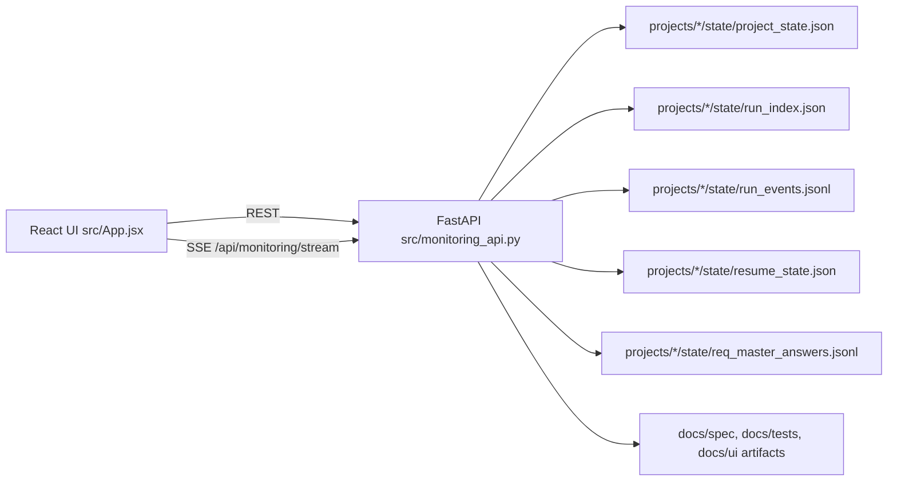

# SWEAT Project 1 Monitoring Dashboard

_Last updated: 2026-03-03 UTC_

## Scope
Project 1 delivers an operator-facing monitoring command center with:
- dashboard list of in-progress/completed SWEAT projects
- per-project details/status page
- pipeline stage visualization aligned to SWEAT flow
- live run event streaming
- req_master interview Q&A loop from UI
- artifact registry + preview links for SWEAT outputs
- blocker/failure visibility + telemetry KPIs

## Runtime architecture



## Data flow
1. SWEAT agents persist lifecycle snapshots/events via `StateStore` in project state folders.
2. Monitoring API reads these files and normalizes status/stages for UI consumption.
3. UI fetches dashboard and detail payloads over REST.
4. UI opens SSE stream (`/api/monitoring/stream`) for live event delivery.
5. Operator submits req_master answers via POST endpoint.
6. API stores answers, updates `resume_state.json` open questions, appends integration event for audit traceability.

## Stage mapping
Canonical dashboard flow:
- `requirement_master`
- `specify`
- `plan`
- `tasks`
- `architect`
- `pixel`
- `frontman`
- `code_smith`
- `review`
- `ci_deploy_automator`

Node names (`req_master_interview`, `sdd_specify`, `codesmith`, `gatekeeper`, `pipeline`, `deployer`, `automator`) are mapped into this sequence server-side.

## API surface
- `GET /healthz`
- `GET /api/monitoring/projects`
- `GET /api/monitoring/projects/{project_id}`
- `GET /api/monitoring/projects/{project_id}/events?limit=...`
- `GET /api/monitoring/projects/{project_id}/interview`
- `POST /api/monitoring/projects/{project_id}/interview/answer`
- `GET /api/monitoring/projects/{project_id}/artifacts/{artifact_key}`
- `GET /api/monitoring/stream?project_id=...`

## Operator usage
### Start orchestration (existing SWEAT run)
```bash
./run.sh
```

### Start monitoring API
```bash
source .venv/bin/activate
uvicorn src.app:app --host 0.0.0.0 --port 8000
```

### Frontend
The React monitoring UI is implemented in `src/App.jsx` and consumes the API routes above. Integrate with your existing frontend host/bundler and set `globalThis.__SWEAT_API_BASE__` when needed.

## Observability and failure handling
- UI surfaces run KPI counts and blocker panels derived from:
  - failed/blocked run states from `run_index.json`
  - `validation_error` and `retry_scheduled` events
- live stream panel shows newest run events in near real time
- API errors and stream connection state are visible in the dashboard header/body

## Files changed for Project 1
- `src/monitoring_api.py`: monitoring backend + SSE + interview/artifact handlers
- `src/app.py`: ASGI entrypoint for FastAPI
- `src/App.jsx`: live command center and project detail experience
- `tests/test_monitoring_api.py`: backend pathway tests
- `tests/test_dashboard_frontend_states.py`: critical frontend state coverage

