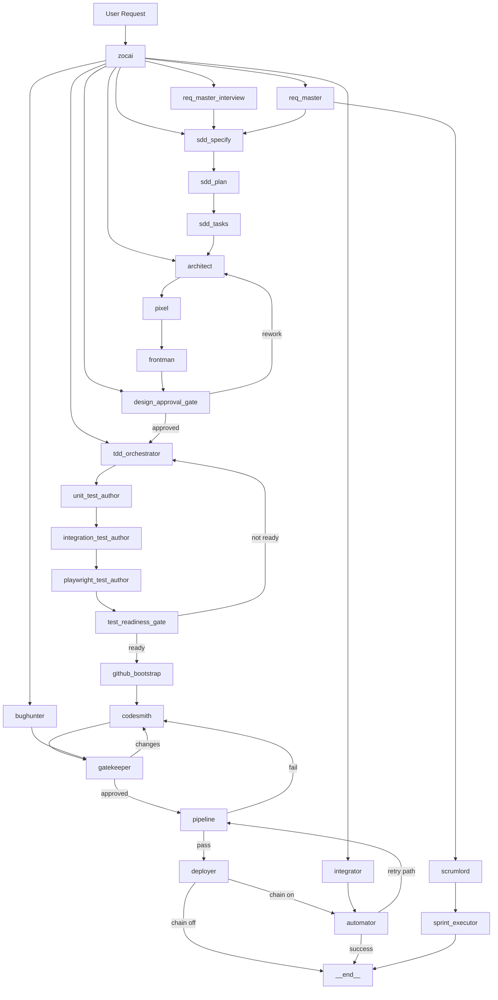

# SWEAT System Deep-Dive (As-Built)

_Last updated: 2026-02-24 UTC_

## 1) What SWEAT is
SWEAT is an autonomous multi-agent software factory that executes end-to-end software lifecycle:

- requirement interview
- SDD (`specify -> plan -> tasks`)
- design (Architect + Pixel + Frontman)
- TDD readiness gating
- coding/review/CI
- deploy + automation
- project/sprint execution in Linear
- GitHub bootstrap + governance + CI/CD
- security scan/remediation/rescan/documentation loop

## 2) Current node architecture (26 nodes)
Core orchestrator/persona/gate/stage/infra nodes:
`zocai, req_master, req_master_interview, sdd_specify, sdd_plan, sdd_tasks, architect, pixel, frontman, design_approval_gate, tdd_orchestrator, unit_test_author, integration_test_author, playwright_test_author, test_readiness_gate, github_bootstrap, codesmith, bughunter, gatekeeper, pipeline, integrator, automator, deployer, scrumlord, sprint_executor, __end__`

## 3) Complete architecture diagram (current)

## 4) Key as-built capabilities
- Interview-first requirements and ambiguity handling
- SDD quality scoring + non-testable acceptance criteria block
- Requirement→test→implementation traceability map (`docs/spec/traceability_map.json`)
- GitHub private-only bootstrap with .gitignore and policy files
- Branch protection enforcement with explicit bypass flag
- Strict CI template with matrix/cache/security gates
- Security auto-remediation loop and before/after report
- Pipeline auto-post to Linear with remediation summary excerpt
- Sprint executor v2 (priority + WIP + multi-issue budget)
- Run telemetry and per-run report artifact (`reports/runs/latest_run_report.json`)

## 5) Current readiness
- TODO pending: 0
- Linear SWEAT project open issues: 0
- Production stance: GO (controlled governance mode)

## 6) Living-doc note
This file must be updated with every architectural change (node/edge/gate/integration/policy).

<!-- DOC_SYNC: 2026-02-24 -->
