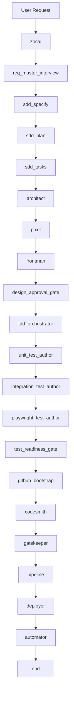

# SWEAT System — Stakeholder Brief (Current)

_Last updated: 2026-02-24 UTC_

## Executive summary
SWEAT is an autonomous software factory that can take a request from idea to deployment through controlled gates:
- requirements interview
- SDD and design
- TDD readiness before coding
- coding/review/CI
- deploy + automation
- project/sprint operations in Linear

## What changed recently
- GitHub bootstrap with private-only enforcement and policy scaffolding
- Strict CI/CD template with matrix/cache/security stages
- Security remediation loop (scan -> safe remediation -> rescan -> report)
- Pipeline auto-comment to Linear with remediation summary
- Sprint executor v2 (priority + WIP + multi-issue budget)
- Observability: telemetry + run report artifacts + nightly healthcheck workflow

## Complete architecture (high-level)

## Production readiness
Current decision: **GO (controlled production)** with governance guardrails.

## Tracking state
- TODO pending: 0
- Linear SWEAT open issues: 0

<!-- DOC_SYNC: 2026-02-24 -->
